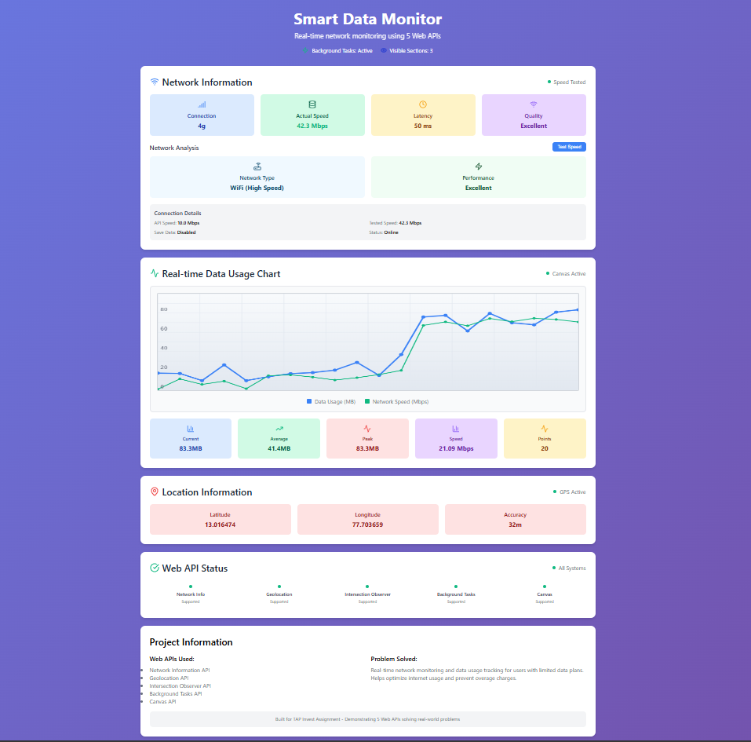
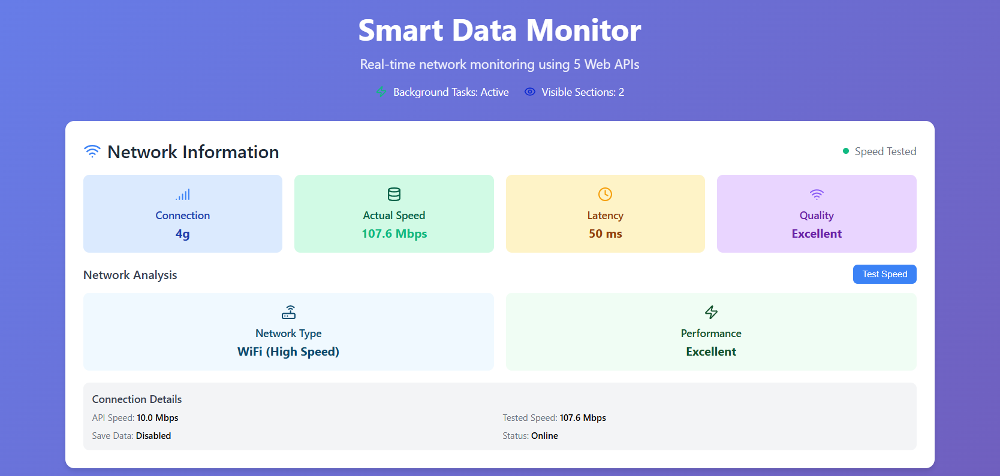
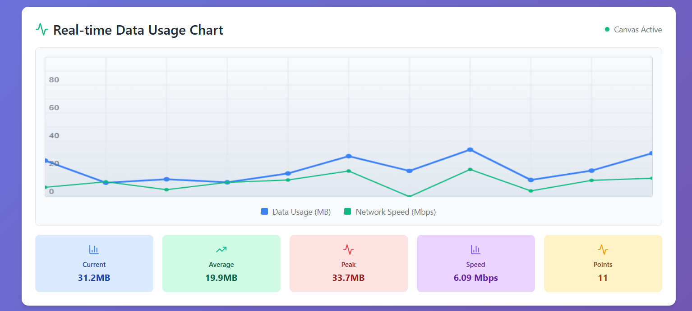
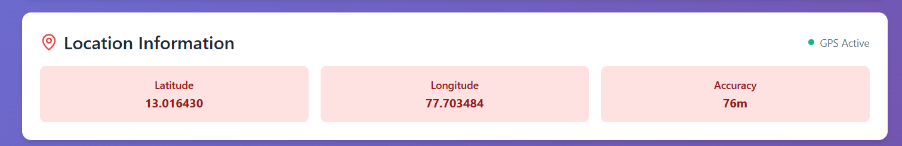
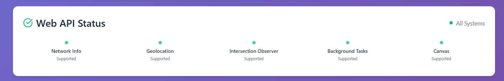

# 🌐 Smart Data Monitor

A comprehensive real-time network monitoring application demonstrating 5 modern Web APIs

---

## 📋 What This Project Is About

Smart Data Monitor is a React-based web application that provides real-time network monitoring and data usage tracking. The application demonstrates the practical implementation of 5 powerful Web APIs working together to solve real-world connectivity challenges.

**Core Functionality:**

- Real-time network speed testing with accurate measurements
- Live data visualization through interactive charts
- GPS location tracking with high precision
- Smart performance monitoring using background processes
- Responsive user interface with scroll-based interactions

---

## 📸 Application Screenshots

### 🖥️ Full Application Overview


_Complete application showing all features integrated together_

### 🌐 Network Information Panel


_Network Information API showing connection type and speed_

### 📊 Real-time Data Charts


_Live Canvas-based charts showing network speed and data usage_

### 🌍 Location Services


_Geolocation API in action with coordinate display_

### 📡 Web API Status Dashboard


_Real-time status monitoring of all 5 Web APIs_

---

## 🎯 Why I Chose This Project

### Real-World Problem Solving

In today's digital world, data costs and network performance are critical concerns, especially for:

- Users with limited data plans who need to monitor usage
- Remote workers requiring reliable connectivity tracking
- Mobile users who need real-time network insights
- Developers testing application performance across different networks

### Technical Challenge

This project allowed me to:

- Master 5 different Web APIs in a single cohesive application
- Solve integration challenges between multiple browser technologies
- Build performance-optimized real-time data visualization
- Create responsive design that works across all devices
- Implement fallback strategies for various browser capabilities

### Innovation Opportunity

Rather than building separate demos for each API, I chose to create a unified application where all APIs work together, demonstrating how modern web technologies can solve complex problems when properly integrated.

---

## 🛠️ Technology Stack

### Frontend Framework

- **React 18** - Component-based UI with modern hooks
- **JavaScript ES6+** - Latest language features and async/await
- **CSS3** - Custom styling with flexbox and grid layouts

### Development Tools

- **Vite** - Fast build tool and development server
- **ESLint** - Code quality and consistency
- **Lucide React** - Modern icon library

### Web APIs Integration

| API                       | Implementation Purpose                           |
| ------------------------- | ------------------------------------------------ |
| Network Information API   | Monitor connection type, speed, and quality      |
| Geolocation API           | Track user location for location-based insights  |
| Intersection Observer API | Optimize performance with smart scroll detection |
| Background Tasks API      | Handle non-blocking background processing        |
| Canvas API                | Render real-time charts and data visualization   |

---

## 🚀 Key Features

### 🌐 Network Monitoring

- Cloudflare-powered speed tests for accurate measurements
- Real vs API speed comparison showing true performance
- Connection quality analysis with smart categorization
- Network type detection (WiFi, 4G, 3G) with fallbacks

### 📊 Live Data Visualization

- Canvas-based real-time charts updating every 3 seconds
- Dual-line visualization for data usage and network speed
- Interactive statistics showing current, average, and peak values
- Responsive design adapting to all screen sizes

### 📍 Location Services

- High-accuracy GPS positioning with error handling
- Permission management with user-friendly messaging
- Coordinate display with customizable precision
- Privacy-focused implementation

### ⚡ Performance Optimization

- Smart scroll tracking using Intersection Observer
- Background task processing for non-blocking operations
- Efficient re-rendering with React optimization techniques
- Graceful degradation for unsupported browsers

---

## 📁 Project Architecture

```
src/
├── components/           # Reusable UI components
│   ├── common/          # Shared components (Wrapper, Header, StatBox)
│   ├── NetworkInfo.jsx  # Network monitoring dashboard
│   ├── DataChart.jsx    # Real-time chart visualization
│   ├── LocationInfo.jsx # GPS location display
│   └── APIStatus.jsx    # API status monitoring
├── hooks/               # Custom React hooks
│   ├── useNetworkInfo.js
│   ├── useGeolocation.js
│   ├── useIntersectionObserver.js
│   └── useBackgroundTasks.js
├── styles/              # Organized CSS modules
└── utils/               # Helper functions and error handling
```

## 🚀 Quick Start

```bash
# Clone and install
git clone <repository-url>

# Navigate into the project directory
cd smart-data-monitor

# Install dependencies
npm install

# Start development server
npm run dev

# Open http://localhost:5173
```

### Build for Production

```bash
npm run build
npm run preview
```

## 🌟 Implementation Highlights

### Smart Speed Testing

- 25MB download tests using Cloudflare endpoints
- Intelligent fallback when tests fail
- Automatic retry logic with 2-minute intervals
- Cross-browser compatibility with error handling

### Real-time Chart Rendering

- Canvas API optimization for 60fps performance
- Dynamic scaling based on actual data ranges
- Memory management keeping only last 20 data points
- Smooth animations with efficient rendering cycles

### Advanced Location Handling

- Progressive permission requests with clear explanations
- High-accuracy mode when available
- Timeout management for slow GPS responses
- Error state handling for denied permissions

---

## 🌐 Browser Support

| Feature               | Chrome    | Firefox      | Safari       | Edge      |
| --------------------- | --------- | ------------ | ------------ | --------- |
| Network API           | ✅ Native | 🟡 Simulated | 🟡 Simulated | ✅ Native |
| Geolocation           | ✅ Full   | ✅ Full      | ✅ Full      | ✅ Full   |
| Canvas                | ✅ Full   | ✅ Full      | ✅ Full      | ✅ Full   |
| Intersection Observer | ✅ Full   | ✅ Full      | ✅ Full      | ✅ Full   |
| Background Tasks      | ✅ Full   | ✅ Full      | ✅ Full      | ✅ Full   |

## 📊 Performance Metrics

- **First Contentful Paint**: < 1.5s
- **Interactive**: < 2.5s
- **Real-time Updates**: 60fps chart rendering
- **Memory Usage**: Optimized with data cleanup
- **Bundle Size**: < 500KB gzipped

---

## 🔧 Configuration

### Speed Test Settings

```javascript
const SPEED_TEST_CONFIG = {
  fileSize: 25 * 1024 * 1024, // 25MB
  timeout: 15000, // 15 seconds
  retryInterval: 120000, // 2 minutes
};
```

### Chart Update Frequency

```javascript
const CHART_CONFIG = {
  updateInterval: 3000, // 3 seconds
  maxDataPoints: 20, // Last 20 points
  animationDuration: 300, // Smooth transitions
};
```

## 🎯 Project Goals Achieved

### ✅ Web API Mastery

- Successfully integrated 5 different Web APIs
- Implemented robust error handling for all APIs
- Created fallback strategies for unsupported browsers
- Demonstrated real-world practical applications

### ✅ Technical Excellence

- Clean, maintainable code with proper component separation
- Performance optimization with efficient rendering
- Responsive design working across all devices
- Professional documentation and code organization

### ✅ Problem-Solution Fit

- Addresses real user needs for network monitoring
- Provides actionable insights for data usage
- Offers practical utility beyond just API demonstration
- Scalable architecture for future enhancements

---

## 📧 Developer

**Udbhav Kumar**  
Full Stack Developer specializing in modern web technologies

## 📝 License

MIT License - Open source and free to use

<div align="center">

🚀 **Production Ready Application** 🚀  
_Demonstrating the power of modern Web APIs through practical, real-world solutions_

</div>
